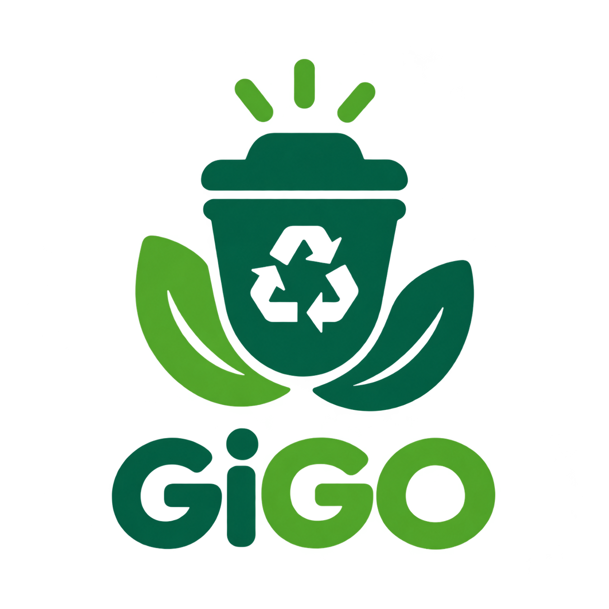

  

 Garbage in, Garbage out 

  <strong>An offline-first waste-sorting mobile app that helps users identify waste and learn how to dispose of it responsibly.</strong>

About GiGO🌱 

GiGO is a waste-sorting companion designed to make everyday waste disposal easier. The app is designed around an offline-first experience, so its core waste-sorting workflow can be used without depending on a constant internet connection.

Features
- Waste scanning — take a photo with the camera or choose an image from the gallery.
- Waste classification — view the detection result and its suggested waste category.
- Waste categories — Biodegradable, Recyclable, Residual, and Special Waste.
- Scan history — save scan results locally for later reference.
- Eco-friendly guidance — make better disposal decisions through simple, accessible information.
Feature availability depends on the current implementation. Update this list as features are completed.

Reminder: Disposal rules vary by locality. Treat app results as guidance and follow your local waste-management rules, especially for hazardous or special waste.
Tech Stack
- React Native
- Expo
- TypeScript
- Expo Image Picker for camera and gallery image selection
- Local storage for saving scan history
- Waste-detection module in the project's ML directory

Prerequisites
- (to be followed)
- Expo Go on a compatible mobile device, or an emulator/simulator
- The project source code and required model files
Install and run
npm install
npx expo start
Follow the Expo CLI instructions to open the app on a device or emulator.

Our Goal
Help people make more informed waste-sorting decisions—one scan at a time.

  <strong>GiGo — Garbage in, Garbage out.</strong>

